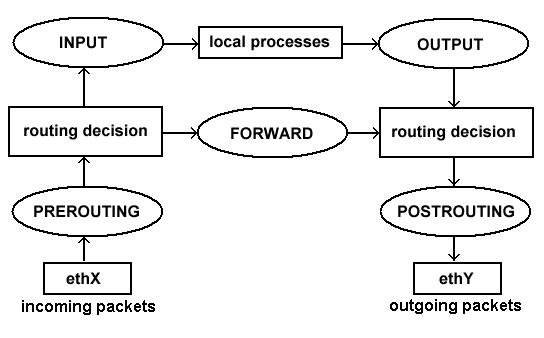

# Configuration réseau/iptables sous GNU/Linux

Voici quelques commandes sous GNU/Linux pour configurer le réseau et le
firewall. On parle des commandes `ethtool`, `ip`, `bridge` et `iptables`.

Ces commandes sont à taper avec les droits d'administration.

## Ethernet

### Interfaces

|Action|Commande|
|------|--------|
|Observation interface|`# ethtool eth0`|
|Repérer une interface|`# ethtool -p eth0`|

### Ponts (bridges)

|Action|Commande|
|------|--------|
|Créer un pont|`# ip link add br0 type bridge`|
|Détruire un pont|`# ip link del br0 type bridge`|
|Ajouter une interface à un pont|`# ip link set eth0 master br0`|
|Supprimer une interface|`# ip link set eth0 nomaster`|
|Choix de la priorité d'une interface|`# bridge link set dev eth0 priority 69`|
|Ajouter une adresse|`# bridge fdb add c0:ff:ee:c0:ff:ee dev eth0 master temp`|
|Supprimer une adresse|`# bridge fdb del c0:ff:ee:c0:ff:ee dev eth0 master temp`|
|Etat de la base de données|`# bridge fdb show`|

### VLAN

|Action|Commande|
|------|--------|
|Ajouter une interface|`# ip link add link eth0 name eth0.14 type vlan id 14`|
|Supprimer une interface|`# ip link del link eth0 name eth0.14 type vlan id 14`|
|Autoriser certains VLANs|`# bridge vlan add vid 100 dev br0`|
|Interdire certains VLANs|`# bridge vlan del vid 100 dev br0`|
|Observation d'un VLAN|`# bridge vlan show`|

## IP

### Interfaces

On note que des alias sont disponibles : par exemple `addr` peut s'écrire
simplement `a`.

|Action|Commande|
|------|--------|
|Configurer ou ajouter une adresse|`# ip addr add 192.168.1.1/24 dev eth0`|
|Supprimer une adresse|`# ip addr del 192.168.1.1/24 dev eth0`|
|Activer une interface|`# ip link set dev eth0 up`|
|Désactiver une interface|`# ip link set dev eth0 down`
|Voir une interface|`# ip addr show dev eth0`|
|Voir les interfaces actives|`# ip addr show` (alias `# ip a`)|

### Routage

|Action|Commande|
|------|--------|
|Activer le routage|`# echo 1 > /proc/sys/net/ipv4/ip_forward`|
|Désactiver le routage|`# echo 0 > /proc/sys/net/ipv4/ip_forward`|
|Ajouter une route|`# ip route add 192.168.10.0/24 via 192.168.20.1`|
|Supprimer une route|`# ip route del 192.168.10.0/24 via 192.168.20.1`|
|Voir les routes|`# ip route show` (alias `# ip r`)|

### iptables

|Action|Commande|
|------|--------|
|Source NAT d'une adresse|`# iptables -t nat -a POSTROUTING -o eth0 -j SNAT 192.168.1.10`|
|Source NAT d'une adresse pour un port|`# iptables -t nat -A POSTROUTING -p tcp --dport 80 -o eth0 -j SNAT --to 192.168.1.10`|
|Destination NAT d'une adresse pour un port|`# iptables -t nat -A PREROUTING -p tcp -d 147.127.0.0/16 -dport 80 -j DNAT --to 147.127.16.100:8080`|
|Connecter un LAN à Internet (`eth1` est l'interface connectée à Internet)|`# iptables -t NAT -A POSTROUTING -o eth1 -j MASQUERADE`|
|Lister toutes les règles|`# iptables -L`|
|Changer la politique sur un *chain*|`# iptables -policy <INPUT\|OUTPUT\|FORWARD> <ACCEPT\|DROP\|REJECT\|LOG>`|
|Vider toutes les tables|`# iptables -F`|

|Type|Elements|
|-|-|
|Tables|`raw, mangle, nat, filter`|
|Chains|`PREROUTING, INPUT, FORWARD, OUTPUT, POSTROUTING`|
|Targets|`ACCEPT, DROP, REJECT, LOG`|
|Targets pour la table `nat` uniquement|`SNAT, DNAT, MASQUERADE, REDIRECT`|

Schéma de routage de `iptables` :

|Chain|Tables|
|-|-|
|`PREROUTING`|`raw, mangle, nat`|
|`INPUT`|`mangle, filter`|
|`FORWARD`|`mangle, filter`|
|`OUTPUT`|`raw, mangle, nat, filter`|
|`POSTROUTING`|`mangle, nat`|
